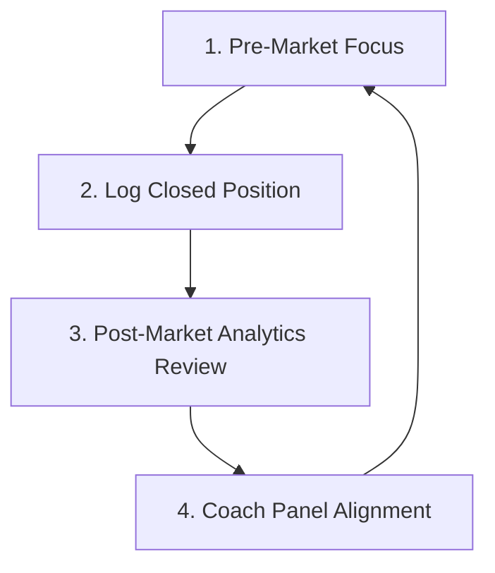

# Journal.ai — VPS Deployment and Usage Guide

Welcome to **Journal.ai**, your premium trading journal for Indian (NSE/BSE) and Crypto markets. This guide explains how the app works, how to run it locally, and how to deploy and manage it on your **Hostinger VPS** using a server-side SQLite database (no local storage limits!).

---

## Table of Contents
1. [Running Locally](#1-running-locally)
2. [Data Storage (Express + SQLite)](#2-data-storage-express--sqlite)
3. [Hostinger VPS Deployment Guide](#3-hostinger-vps-deployment-guide)
4. [Daily Real-Life Trading Workflow](#4-daily-real-life-trading-workflow)

---

## 1. Running Locally

To run the full application (frontend + database backend) on your local machine:

### Prerequisites
Make sure you have **Node.js** (v18 or newer) installed.

### Steps to Run
1. Open your terminal in the project directory.
2. Install the dependencies:
   ```bash
   npm install
   ```
3. Compile the frontend assets:
   ```bash
   npm run build
   ```
4. Start the Express backend server:
   ```bash
   npm start
   ```
5. Open your web browser and navigate to **`http://localhost:3000/`**.

*Note: For frontend development with hot reloading, you can run `npm run dev` in one terminal window, and run `node server.js` in another. Requests to `/api` are automatically proxied from port 5173 to port 3000.*

---

## 2. Data Storage (Express + SQLite)

Instead of using browser local storage, Journal.ai stores your trades and configuration settings in a robust, server-side **SQLite database**.

### Key Advantages
- **Server Persistence**: Your trades are safe on your Hostinger VPS, even if you clear your browser cookies, history, or change devices.
- **Cross-Device Syncing**: You can access your journal from your computer, laptop, or mobile browser and see the exact same logs in real-time.
- **No Storage Limits**: Browsers limit local storage to 5MB, which restricts screenshots. SQLite runs on your VPS disk, letting you store thousands of trades and images.
- **Single Database File**: The entire database is stored in a single file named `database.sqlite` at the root of the project, making backups as simple as copying the file.

---

## 3. Hostinger VPS Deployment Guide

Here is the step-by-step instruction to host the application on your **Hostinger VPS** using **PM2** (Process Manager) and Nginx.

### Step 1: Connect to your VPS
SSH into your Hostinger VPS using your terminal:
```bash
ssh root@<your-vps-ip>
```

### Step 2: Install Node.js & Git (If not already installed)
Ensure Node.js (v18+) and Git are installed on your VPS:
```bash
# Update packages
sudo apt update

# Install Node.js via NodeSource
curl -fsSL https://deb.nodesource.com/setup_18.x | sudo -E bash -
sudo apt install -y nodejs git
```

### Step 3: Clone & Install the Project
Clone your repository onto the VPS:
```bash
# Clone the repository
git clone <your-git-repo-url> /var/www/trading-journal
cd /var/www/trading-journal

# Install package dependencies
npm install
```

### Step 4: Build & Test Run
Compile the frontend assets and run the server to test:
```bash
# Build React static assets
npm run build

# Test run the server
node server.js
```
*You should see the output: "Server is running on port 3000". Press `Ctrl + C` to stop the server.*

### Step 5: Configure PM2 (Process Manager)
To keep the application running 24/7 in the background (even after you close your SSH session), use PM2:
```bash
# Install PM2 globally
sudo npm install -g pm2

# Start the server under PM2
pm2 start server.js --name "trading-journal"

# Save the PM2 process list and configure it to start on VPS boot
pm2 save
pm2 startup
```
*Run the command outputted by `pm2 startup` to enable boot persistence.*

### Step 6: Expose the App (Nginx Reverse Proxy)
Since the app runs on port `3000` inside the VPS, you should route standard HTTP (`80`) or HTTPS (`443`) traffic to it using Nginx:

1. Install Nginx:
   ```bash
   sudo apt install -y nginx
   ```
2. Create Nginx server configuration:
   ```bash
   sudo nano /etc/nginx/sites-available/trading-journal
   ```
3. Paste the following configuration (replace `yourdomain.com` with your VPS IP or custom domain):
   ```nginx
   server {
       listen 80;
       server_name yourdomain.com www.yourdomain.com;

       location / {
           proxy_pass http://localhost:3000;
           proxy_http_version 1.1;
           proxy_set_header Upgrade $http_upgrade;
           proxy_set_header Connection 'upgrade';
           proxy_set_header Host $host;
           proxy_cache_bypass $http_upgrade;
       }
   }
   ```
4. Enable the configuration and restart Nginx:
   ```bash
   sudo ln -s /etc/nginx/sites-available/trading-journal /etc/nginx/sites-enabled/
   sudo rm /etc/nginx/sites-enabled/default
   sudo nginx -t
   sudo systemctl restart nginx
   ```

Now, visit your domain or VPS IP in the browser and your premium trading journal is live!

---

## 4. Daily Real-Life Trading Workflow

To get the maximum value out of **Journal.ai**, integrate it directly into your daily routine:



### Phase A: Pre-Market Focus (Before Market Open)
- Look at the **Journal.ai Coach** focus input on the Dashboard.
- Write your primary discipline focus for the session (e.g., *"I will not move my stop losses down today; I will let the trade play out"*).
- Your focus automatically autosaves to the SQLite database.

### Phase B: Execution (During the Session)
- Take a trade on your broker terminal.
- Go to the **Log Trade** tab:
  - Set the market (Equity, Index, or Crypto) and direction (BUY/SELL).
  - Enter the **Entry Price**, **Exit Price**, **Stop Loss (SL)**, and **Take Profit (TP)**.
  - Select the emoji that matches your actual emotional state *before* clicking buy (Calm 😊, Confident 😎, Anxious 😟, Revenge 😡).
  - Attach a chart screenshot (base64 URL, stored in SQLite) or type notes and click **Save**.

### Phase C: Review (Post-Market)
- Check the **AI Coach panel** for automated diagnostics (flags emotional leaks, streaks, and risk-reward ratios).
- Open **Analytics** to view the **Calendar Heatmap** (to audit green/red day streaks) and the **Size vs P&L Scatter Plot** (to check if your biggest losses are tied to size inflation).
