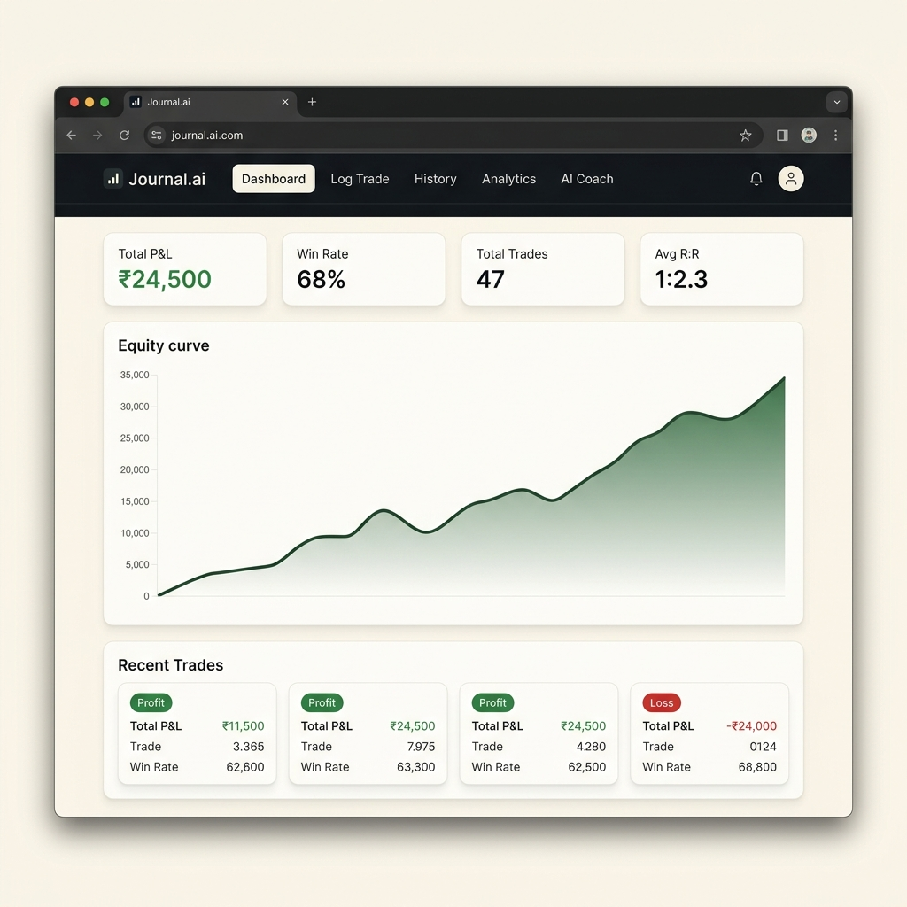
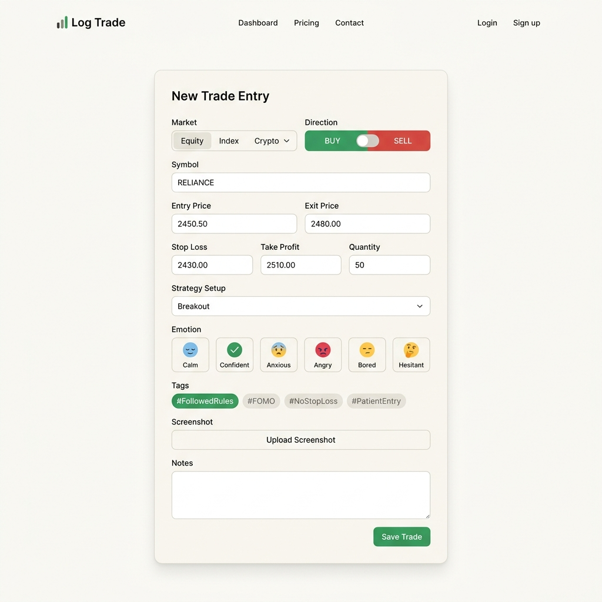
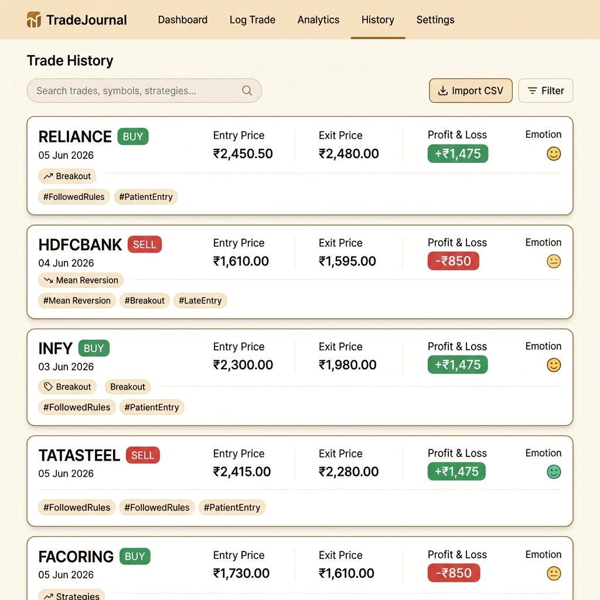
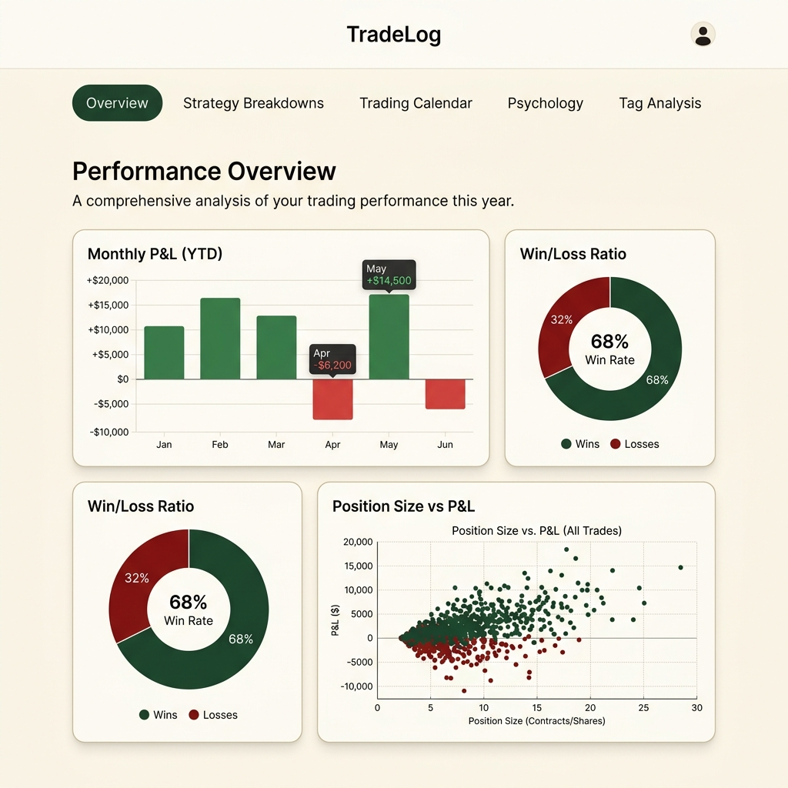
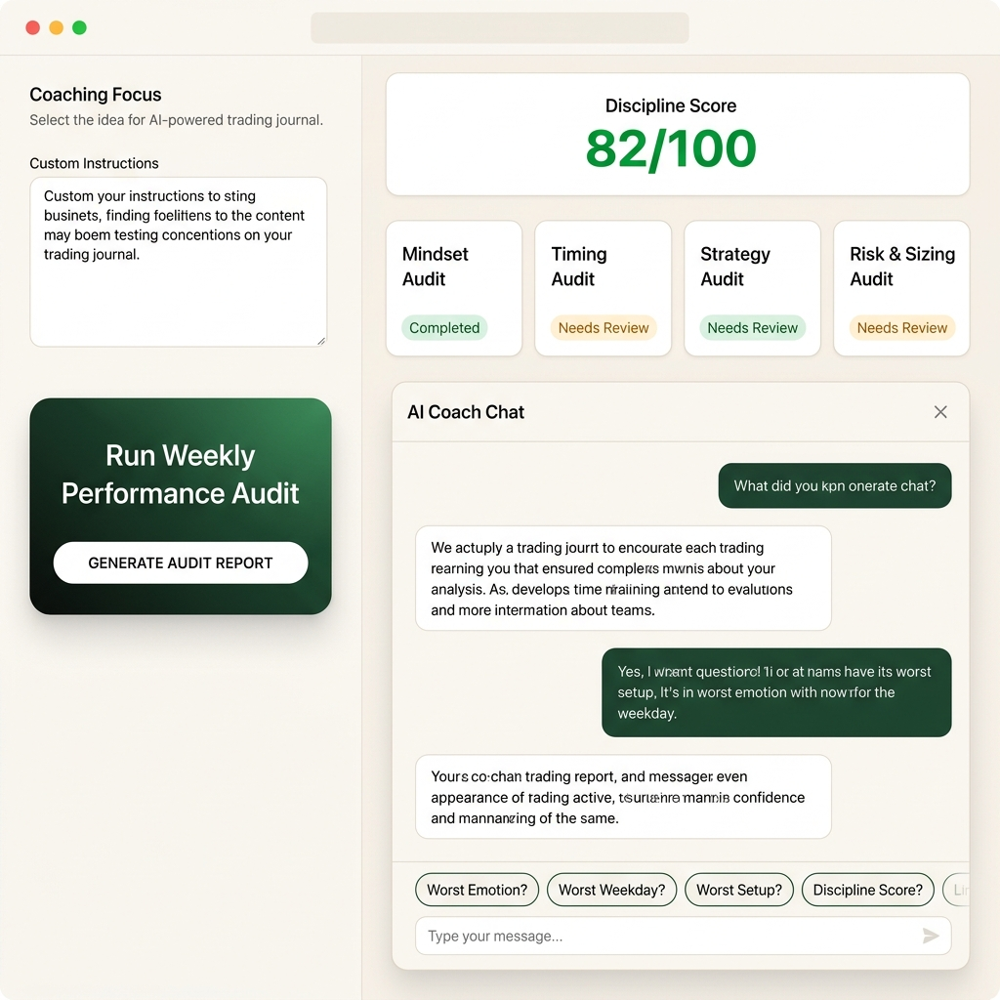

# Journal.ai — App Overview & New User Guide

Welcome to **Journal.ai**, your premium trading journal for Indian (NSE/BSE) and Crypto markets. This guide walks you through every screen of the app with screenshots and simple instructions.

---

## App Overview

Journal.ai is a **cloud-synced trading journal** that helps you:
- **Log every trade** with entry/exit prices, emotions, strategies, and chart screenshots
- **Track your P&L** with an interactive equity curve and performance stats
- **Analyze your patterns** through calendar heatmaps, strategy breakdowns, and psychology metrics
- **Get AI-powered coaching** that audits your behavioral leaks and helps you build discipline

Your data is stored securely on a server — access it from any device, anytime.

---

## 1. Dashboard

The **Dashboard** is your home screen. It gives you a quick snapshot of your trading performance at a glance.



### What you see here:
| Element | What it shows |
| :--- | :--- |
| **Equity Curve** | A line chart of your cumulative P&L over time |
| **Total P&L** | Your net profit or loss across all closed trades |
| **Win Rate** | Percentage of your trades that ended in profit |
| **Total Trades** | How many trades you have logged and closed |
| **Starting Capital** | Click this in the header to set your base capital amount |
| **Recent Trades** | Quick list of your latest closed trades with P&L badges |

### How to use:
1. Open the app — you land on the Dashboard automatically.
2. Click **"Start Capital"** in the top-right header to set your base capital.
3. The equity curve and stats update automatically as you log and close trades.

---

## 2. Log Trade

The **Log Trade** tab is where you record every trade you take during the session.



### How to log a trade (step by step):

1. **Select Market** — Choose between Equity, Index, or Crypto.
2. **Set Direction** — Click **BUY** (green) or **SELL** (red).
3. **Enter Symbol** — Type the stock/index name (e.g., `RELIANCE`, `NIFTY`, `BTC`).
4. **Fill Prices** —
   - **Entry Price**: The price you entered the trade.
   - **Exit Price**: The price you closed the trade (leave blank if still open).
   - **Stop Loss (SL)**: Your risk level.
   - **Take Profit (TP)**: Your target level.
5. **Set Quantity** — How many shares/lots/units.
6. **Choose Strategy** — Pick from your saved strategy setups, or create a new one by selecting "Add New Strategy".
7. **Select Emotion** — Pick the icon that matches your mental state *before* you clicked Buy/Sell:
   - 😊 Calm & Happy
   - 😎 Overconfident
   - 😟 Anxious / Fearful
   - 😡 Revenge / Anger
   - 😴 Bored
   - 🤔 Indecisive
8. **Tag Your Trade** — Click the tag pills that apply:
   - `#FollowedRules` — You stuck to your plan
   - `#FOMO` — You chased the price
   - `#RevengeTrade` — You entered out of anger
   - `#NoStopLoss` — You didn't set a stop loss
   - `#PatientEntry` — You waited for confirmation
   - `#Overtrading` — Too many trades today
   - And more...
9. **Add a Screenshot** — Paste a chart screenshot URL to attach a visual record of the trade.
10. **Write Notes** — Add any observations or trade reasoning.
11. Click **"Save Trade"** — Done! Your trade is saved to the cloud database.

> **💡 Tip:** Log your emotion honestly at the time of the trade, not after the result. This is the most important data for your AI Coach to detect your psychological leaks.

---

## 3. History

The **History** tab shows all your logged trades in a scrollable list.



### What you see here:
- **Trade Cards** — Each card shows the symbol, direction (BUY/SELL), date, entry/exit prices, P&L (green for profit, red for loss), strategy, emotion, and tags.
- **Search Bar** — Filter trades by symbol name.
- **Import CSV** — Bulk-import trades from your broker's CSV export file.

### How to use:
1. Scroll through your trade cards to review past trades.
2. Click on any trade card to expand it and see full details (notes, screenshot, executions).
3. Use **"Import CSV"** to upload trades from your broker if you have a lot of historical data.
4. You can **edit** or **delete** any trade from the expanded card view.

---

## 4. Analytics

The **Analytics** tab is your data laboratory. It breaks down your performance into five detailed sections.



### The five analytics sections:

| Section | What it shows |
| :--- | :--- |
| **Overview** | Monthly P&L bar chart, Win/Loss pie chart, Position Size vs P&L scatter plot |
| **Strategy Breakdowns** | Win rate, net P&L, and trade count for each strategy setup you use |
| **Trading Calendar** | A calendar heatmap showing green (profit) and red (loss) days — spot streaks instantly |
| **Psychology & Emotions** | Which emotions are costing you money? See P&L grouped by your logged emotional state |
| **Tag Analysis** | Which habits help and which hurt? See net P&L and win rate per tag |

### How to use:
1. Click the **sticky navigation tabs** at the top (Overview, Strategy, Calendar, etc.) to jump to any section.
2. Use the **Timeframe Filter** dropdown (top-right) to filter data by month or view all-time stats.
3. In the **Trading Calendar**, click on any day to see the trades you took that day.
4. Scroll down through all sections for a complete picture of your trading behavior.

> **⚠️ Important:** You need to **close at least one trade** (fill in the Exit Price) for the analytics charts to display data.

---

## 5. AI Coach

The **AI Coach** is your personal trading psychologist. It audits your behavioral patterns and gives you data-driven feedback.



### The three key modules:

#### A. Coaching Focus (Left Panel)
- Write your **custom trading instructions** here (e.g., *"No trading after 2:30 PM"*, *"Max 2 trades per day"*).
- These instructions are saved automatically and remind you of your personal rules.

#### B. Performance Audit (Right Panel)
- Click **"Generate Audit Report"** to run an instant analysis of your trade logs.
- The coach evaluates four areas:
  - **Mindset Audit** — Finds your worst emotional state and how much money it cost you.
  - **Timing Audit** — Identifies your worst-performing weekday.
  - **Strategy Audit** — Highlights your most unprofitable strategy setup.
  - **Risk & Sizing Audit** — Checks if your average loss is bigger than your average win.
- You get a **Discipline Score (0–100)** based on your rules compliance.

#### C. AI Coach Chat (Bottom)
- Chat with your AI Coach in natural language!
- Use the **quick action pills** to ask:
  - *"Worst Emotion?"* — Which feeling is costing you the most money?
  - *"Worst Weekday?"* — Which day should you reduce your trading size?
  - *"Worst Setup?"* — Which strategy should you pause or refine?
  - *"Discipline Score?"* — How well are you following your own rules?
- Or type any question about your trading habits.

> **💡 Tip:** The AI Coach uses **your actual trade data** to answer questions. The more trades you log with honest emotions and tags, the smarter and more useful the coach becomes.

---

## Adding a Chart Screenshot to Your Trade

One of the most powerful features of Journal.ai is attaching a **chart screenshot** to every trade. Here's how:

### Step-by-step:
1. Take a screenshot of your chart on your trading platform (e.g., TradingView, Zerodha Kite).
2. Upload the screenshot image to any free image hosting service (e.g., **Imgur**, **Postimages**).
3. Copy the **direct image URL** (the one ending in `.png` or `.jpg`).
4. In the **Log Trade** form, paste the URL into the **"Chart Screenshot URL"** field.
5. Save the trade — the screenshot is now linked to your trade record forever!

### Why screenshots matter:
- During your post-market review, you can see *exactly* what the chart looked like when you entered.
- The AI Coach can correlate your chart setups with your emotional patterns.
- Over time, screenshots build a visual library of your best and worst trades for learning.

---

## Quick Start Checklist for New Users

Here's a simple checklist to get started with Journal.ai:

- [ ] **Set your Starting Capital** — Click the capital amount in the top-right header.
- [ ] **Create your first Strategy** — Go to Log Trade → Strategy dropdown → "Add New Strategy".
- [ ] **Log your first trade** — Fill in all the fields, pick an emotion, select tags, and click Save.
- [ ] **Close the trade** — Once your trade is done, update the Exit Price to close it.
- [ ] **Check the Dashboard** — Watch your equity curve update with your first trade.
- [ ] **Run an Audit** — Go to AI Coach → Click "Generate Audit Report" to see your discipline score.
- [ ] **Ask the Coach** — Try clicking "Worst Emotion?" in the AI Chat to get your first coaching insight.

---

## Daily Trading Workflow

For best results, follow this routine every day:

```
Morning   →  Set your focus rule in the AI Coach
              ↓
During Market  →  Log each trade immediately after taking it
              ↓
After Market   →  Review your trades in History
              ↓
Evening   →  Check Analytics & run an AI Coach Audit
              ↓
Repeat    →  Build consistency over weeks and months
```

> **📝 Note:** Consistency is the key. Log every single trade — even the bad ones. The AI Coach can only help you if it has honest, complete data. The traders who improve the fastest are the ones who journal every day, without exception.

---

## Running Locally

### Prerequisites
Make sure you have **Node.js** (v18 or newer) installed.

### Steps
```bash
# Install dependencies
npm install

# Build the frontend
npm run build

# Start the server
npm start
```

Open your browser and go to **http://localhost:3000/**

*For development with hot reloading, run `npm run dev` in one terminal and `node server.js` in another.*

---

## VPS Deployment (Hostinger)

```bash
# SSH into your VPS
ssh root@<your-vps-ip>

# Navigate to the project
cd /var/www/Journal.ai

# Pull latest changes, install, build, and restart
git pull origin main && npm install && npm run build && pm2 restart Journal.ai --update-env
```

---

Made with ❤️ for disciplined traders.
